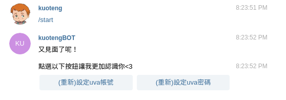

# toc_project

- 計算理論的作業:一個telegram bot
- based on python django framework
    - Django 1.11
    - python 3.5
    - python telegram bot
- 使用gensim之word2vec
    - 私自部屬之機器修改這部份功能, 因為機器效能不佳
- 使用jieba斷詞

# implementation

- 功能:自動上傳程式碼至UVA，繪製FSM圖，天氣查詢，貼圖(sticker)回覆，簡易註冊功能(database)

- 我使用django之django-telegrambot APP，製作telegram_bot相關功能

- 以已經訓練好的資料以gensim載入，經由jieba斷詞查找詞性，過濾出名詞，隨機選取其中一個，查找相關性最高的詞彙做出回覆

- 以beautifulsoup4（查找欄位）、requests來達到自動上傳至UVA的功能

# frame tree

```

kuoteng_bot
├── db.sqlite3
├── jieba_data
│   └── dict.txt.big
├── kuoteng_bot
│   ├── __init__.py
│   ├── settings.py
│   ├── urls.py
│   └── wsgi.py
├── kuoteng_bot.ini
├── manage.py
├── med250.model.bin
├── my_stat_diagram.png
└── telegram_bot
    ├── admin.py
    ├── apps.py
    ├── fsm.py
    ├── __init__.py
    ├── migrations
    │   ├── 0001_initial.py
    │   ├── __init__.py
    ├── models.py
    ├── my_stat_diagram.png
    ├── telegrambot.py
    ├── tests.py
    ├── urls.py
    ├── uva.py
    └── views.py
```

- you can also use `tree` instuction to show on your own shell

# Setup

## clone this repo


```
git clone https://github.com/rapirent/toc_project.git
cd ~/toc_project
```

## virtualenv


- you may probably need to `apt-get install python-software-properties` (or apt) with `apt upgrade` and `apg-get update`

```
apt install virtualenv
sudo apt install python3-dev
sudo python3 get-pip.py
virtualenv -p python3 venv
source venv/bin/activate
```

- you may need `export LC_ALL=C` instuction to let you set virtualenv
- you can use `deactivate` command to leave virtualenv

## install python packages

```
pip install -r requirements.txt
```

- you may need to run the following :

```
sudo apt-get install graphviz libgraphviz-dev pkg-config
apt install pkg-config
sudo -H pip3 install gitsome
```

## set WEBHOOK TOKEN

in kuoteng_bot create your `.secrets.json`
```
cd cd ~/toc_project/kuoteng_bot
vim .secrets.json
```


```
{
    "TOKEN": "YOUR-TOKEN",
    "WEBHOOK_URL": "YOUR-WEBHOOK_URL",
    "DJANGO_TOEKN": ""
}

```

- note that URL must be https(ssl) authentication


- 你也需要引入一個已經訓練好的材料二元檔, 命名為`med250.model.bin`


## Deploy

- test
    - you may need to use `ngrok`(provided in repo)

```
python manage.py runserver
```

- uwsgi&nginx

```
sudo uwsgi --ini kuoteng_bot.ini
```

## stop the server

- ctrl + c or `sudo killall -s INT uwsgi`

# Usage


## start



- 最初使用者尚未登錄於資料庫中, 位於`()not_have_used_start_to_set`狀態` , 如果使用者使用`/start`方法，則會將其寫入資料庫中，變為`(-1)uva_unenroll_user`狀態
    - 並且會回傳按鈕，使使用者可以點選而設置uva資訊

## fsm info


- 使用者可以呼叫`/fsm`印出狀態圖

## help info

- 使用者可以呼叫'/help'查找使用方法和簡介

## uva info


- 使用者可以呼叫'/uva'查找最後更新的uva資訊(帳號)

## 傳送檔案、貼圖、地點


- 使用者可以傳送檔案，bot會根據uva資訊上傳此檔案至uva judege system上


- 使用者可以傳送貼圖，bot會送回一模一樣的貼圖


- 使用者可以傳送地點，bot會傳回該地點的氣象預報


## 傳送字串


- 使用者傳送字串後，bot會進行斷詞及詞性標示，並且對於句子中的隨機名詞，回傳關聯度高的詞彙

- 查找英文字彙的速度會很慢

- 部屬的機器不是綁在這個bot上喔

# 狀態圖


- 表中狀態前列`()`代表當前資料庫中, User資料表之states欄位

# Reference

- 本次gensim相關參考以下:

[中文斷詞:斷句不要悲劇](http://s.itho.me/techtalk/2017/%E4%B8%AD%E6%96%87%E6%96%B7%E8%A9%9E%EF%BC%9A%E6%96%B7%E5%8F%A5%E4%B8%8D%E8%A6%81%E6%82%B2%E5%8A%87.pdf)

[以 gensim 訓練中文詞向量](http://zake7749.github.io/2016/08/28/word2vec-with-gensim/)

[基於詞向量的主題匹配](http://zake7749.github.io/2016/08/30/chatterbot-with-word2vec/)

[models.lsimodel - 隐含语义分析](http://d0evi1.com/gensim/api/models/lsimodel/)

[LSA潛在語義分析](https://read01.com/PRJ0na.html)

# author

[rapirent](https://github.com/rapirent)

# LICENSE

[MIT](./LICENSE)
