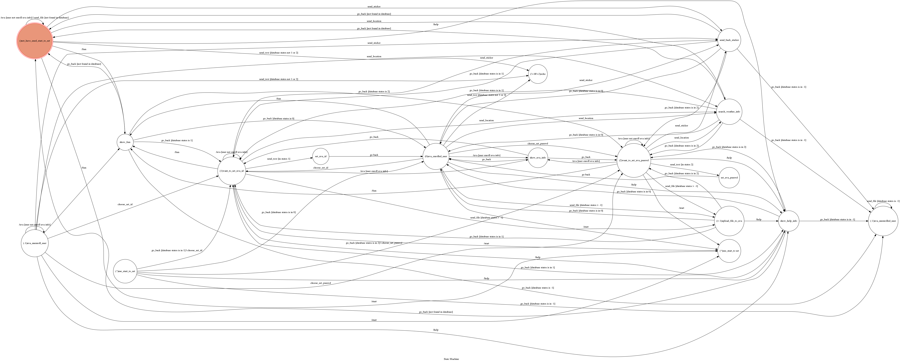

# toc_project

- 計算理論的作業:一個telegram bot
- based on python django framework
    - Django 1.11
    - python 3.5
    - python telegram bot


# frame tree

```
kuoteng_bot
├── db.sqlite3
├── demo.py
├── jieba_data
│   └── dict.txt.big
├── kuoteng_bot
│   ├── __init__.py
│   ├── settings.py
│   ├── urls.py
│   └── wsgi.py
├── manage.py
├── med250.model.bin
├── my_stat_diagram.png
└── telegram_bot
    ├── admin.py
    ├── apps.py
    ├── fsm.py
    ├── __init__.py
    ├── migrations
    │   ├── 0001_initial.py
    │   ├── __init__.py
    ├── models.py
    ├── my_stat_diagram.png
    ├── telegrambot.py
    ├── tests.py
    ├── urls.py
    ├── uva.py
    └── views.py
```

- you can also use `tree` instuction to show on your own shell

# Setup

## clone this repo


```
git clone https://github.com/rapirent/toc_project.git
cd ~/toc_project
```

## virtualenv


- you may probably need to `apt-get install python-software-properties` (or apt) with `apt upgrade` and `apg-get update`

```
apt install virtualenv
sudo apt install python3-dev
sudo python3 get-pip.py
virtualenv -p python3 venv
source venv/bin/activate
```

- you may need `export LC_ALL=C` instuction to let you set virtualenv
- you can use `deactivate` command to leave virtualenv

## install python packages

```
pip install -r requirements.txt
```

- you may need to run the following :

```
sudo apt-get install graphviz libgraphviz-dev pkg-config
apt install pkg-config
sudo -H pip3 install gitsome
```

## set WEBHOOK TOKEN

in kuoteng_bot create your `.secrets.json`
```
cd cd ~/toc_project/kuoteng_bot
vim .secrets.json
```


```
{
    "TOKEN": "YOUR-TOKEN",
    "WEBHOOK_URL": "YOUR-WEBHOOK_URL",
    "DJANGO_TOEKN": ""
}

```
## Deploy

- test
    - you may need to use `ngrok`(provided in repo)

```
python manage.py runserver
```

- uwsgi&nginx

```
sudo uwsgi --ini bot.ini
```

# Usage


# fsm



# Reference

- 本次gensim相關參考以下:

[中文斷詞:斷句不要悲劇](http://s.itho.me/techtalk/2017/%E4%B8%AD%E6%96%87%E6%96%B7%E8%A9%9E%EF%BC%9A%E6%96%B7%E5%8F%A5%E4%B8%8D%E8%A6%81%E6%82%B2%E5%8A%87.pdf)

[以 gensim 訓練中文詞向量](http://zake7749.github.io/2016/08/28/word2vec-with-gensim/)

[基於詞向量的主題匹配](http://zake7749.github.io/2016/08/30/chatterbot-with-word2vec/)

[models.lsimodel - 隐含语义分析](http://d0evi1.com/gensim/api/models/lsimodel/)

[LSA潛在語義分析](https://read01.com/PRJ0na.html)

# author

[rapirent](https://github.com/rapirent)

# LICENSE

[MIT](./LICENSE)
